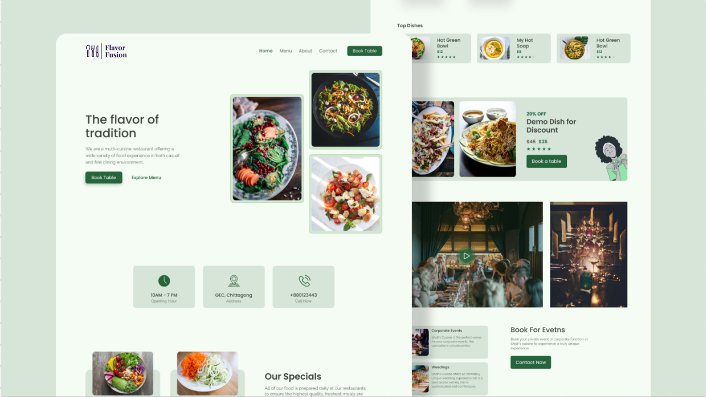
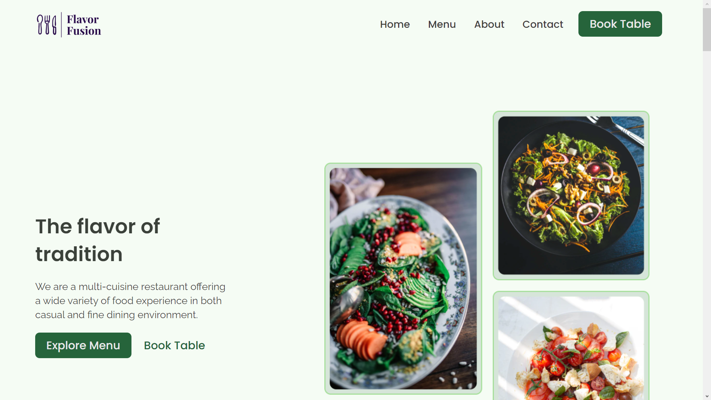
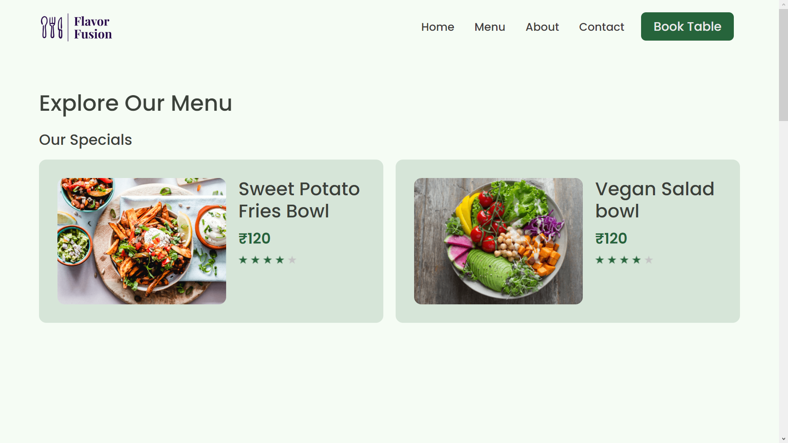
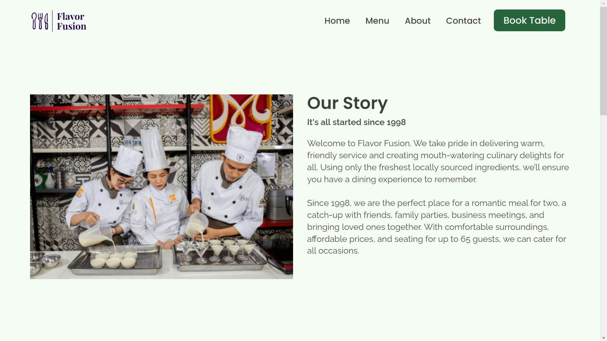
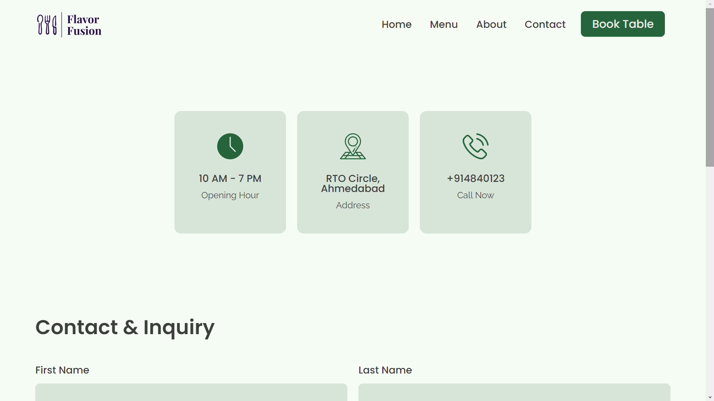
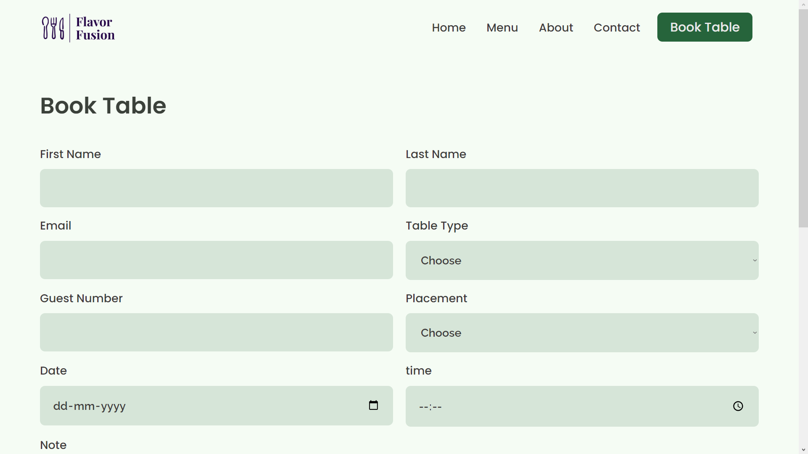

# Flavor Fusion

Welcome to the Flavor Fusion restaurant website!




The website was created using HTML and CSS only, with a few lines of JavaScript for necessary cases. The website has 5 pages: Home, Menu, About, Contact, and Booking.

## Live Demo
https://vishrut225.github.io/Flavor-Fusion/

## Features

- Fully responsive layout that adapts to various screen sizes
- Menu page with food and drink items
- About page with information about the restaurant and its history
- Contact page with a contact form and location information
- Book Table page with booking form

## Tech Stack

- HTML
- CSS

## Getting Started

To get started with this project, simply download or clone this repository and open the index.html file in your web browser.

Clone the project

```bash
  git clone https://link-to-project
```
Change your directory to the cloned repository

```bash
  cd Flavor-Fusion
```

open index.html file

## Screenshots

 &nbsp;  &nbsp; 
 &nbsp; 


## Contributing

Contributions are welcome! If you find any issues or would like to suggest an improvement, please create a new issue or pull request.
